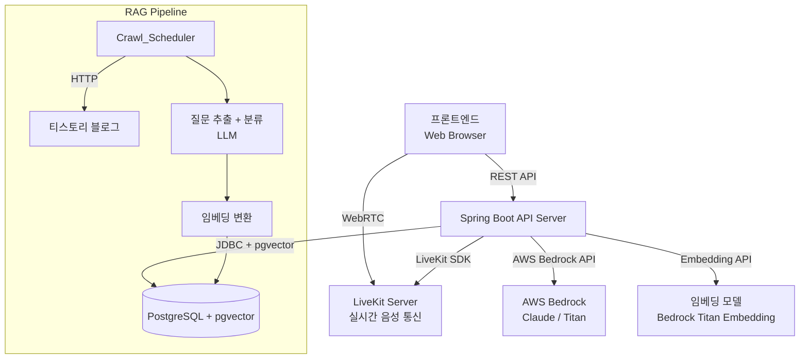
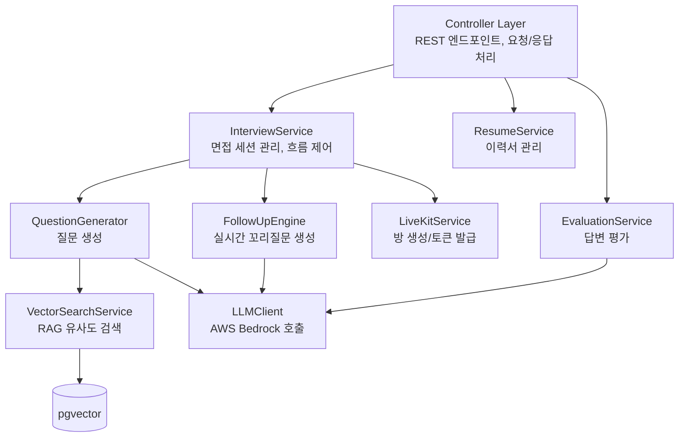
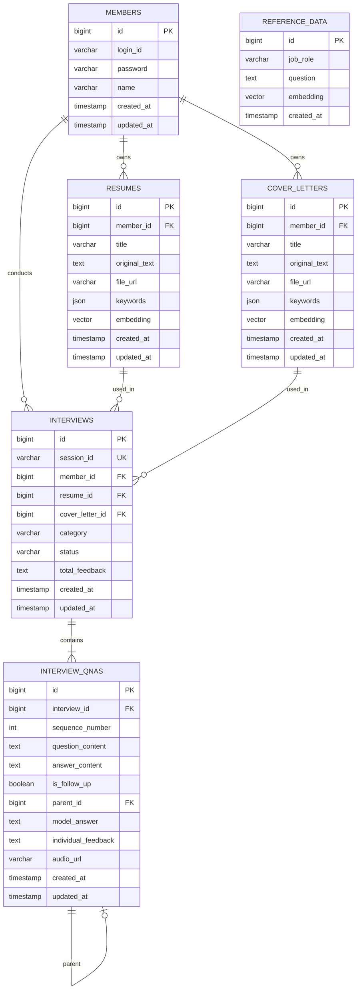

# Design Document: AI 모의 면접 시스템

## Overview

이력서 PDF 파싱 기반의 AI 모의 면접 시스템. Spring Boot 백엔드에서 AWS Bedrock LLM을 활용하여 맞춤형 기술 면접 질문을 생성하고, 꼬리질문과 답변 평가까지 제공한다.

실제 면접 후기를 크롤링하여 RAG 파이프라인으로 벡터DB에 저장하고, 이력서 키워드 기반 유사도 검색으로 현실적인 면접 질문을 보강한다. 음성 입출력(STT/TTS)을 통해 실제 면접과 유사한 경험을 제공한다.

### 주요 설계 결정

- **이력서 입력 방식**: 사용자가 이력서 PDF를 업로드 → PDF 파싱 → LLM이 키워드 추출 → DB 저장
- **꼬리질문 실시간 생성**: 사용자 답변을 분석한 뒤 실시간으로 꼬리질문을 생성하여 맥락에 맞는 질문 제공
- **RAG 보강**: 벡터DB에서 이력서 키워드와 유사한 실제 면접 질문을 검색하여 LLM 프롬프트에 포함
- **음성 모드**: LiveKit 기반 실시간 음성 통신으로 면접 진행 (STT/TTS는 LiveKit AI Agent가 처리)
- **세션 기반 맥락 관리**: interview_qnas 테이블에 질문-답변 이력을 누적하여 중복 방지 및 꼬리질문 판단

### 팀 역할 분담

| 담당 | 개발 범위 | 부가 역할 |
|------|----------|----------|
| 1번 | 회원가입·수정, 이력서/자기소개서 관리, 프론트 | 인프라/배포 |
| 2번 | 질문 생성 서비스(Spring), 꼬리질문 서비스(Spring), RAG 검색, 크롤링/임베딩(Python) | |
| 3번 | 면접 시작~종료 흐름, interview/interview_qnas 저장 | DB 설계 |
| 4번 | LLM 평가 + 피드백 저장, 마이페이지/피드백 조회, 게시판 | CI/CD |

#### 서버 구조

- **Spring Boot (Java)**: 면접 흐름, 질문 생성 LLM 호출, 평가 LLM 호출, 회원/이력서 관리 (실시간 처리)
- **Python AI 서버**: 크롤링, 질문 추출/분류, 임베딩 생성, reference_data 저장 (비실시간 처리)

---

## Architecture

### 시스템 구성도



### 레이어 아키텍처



### 핵심 흐름

1. **이력서 등록 흐름**: PDF 업로드 → 텍스트 추출 → LLM 키워드 추출 → resumes 테이블 저장
2. **면접 시작 흐름**: 이력서/자소서 선택 → 세션 생성 → LiveKit 방 생성 + 토큰 발급 → 프론트 접속
3. **면접 진행 (실시간)**: LiveKit 채널을 통해 음성 질문-답변 교환 → interview_qnas에 기록
4. **면접 종료 흐름**: 종료 요청 → 세션 상태 COMPLETED → AI 피드백 생성 (비동기)
5. **RAG 파이프라인**: Crawl_Scheduler → 블로그 크롤링 → LLM 면접 후기 식별 → 질문 추출/분류 → 임베딩 → pgvector 저장

---

## Components and Interfaces

### REST API 엔드포인트

| Method | Path | 설명 | 요청 | 응답 | 상태 |
|--------|------|------|------|------|------|
| POST | `/v1/interviews/sessions` | 면접 세션 생성 + LiveKit 방 생성 | `SessionCreateRequest` | 200 + `SessionCreateResponse` | 확정 |
| POST | `/v1/interviews/sessions/{sessionId}/end` | 면접 세션 종료 | `SessionEndRequest` | 200 + `SessionEndResponse` | 확정 |
<!-- TODO: 이력서/자소서 관련 API (1번 담당) -->
<!-- TODO: 피드백 조회 API (4번 담당) -->
<!-- TODO: 회원 관련 API (1번 담당) -->
<!-- TODO: 마이페이지/게시판 API (4번 담당) -->

### 주요 컴포넌트

#### InterviewController / InterviewService
- 면접 세션 생성, 종료
- LiveKit 방 생성 및 접속 토큰 발급
- 세션 상태 관리 (READY → IN_PROGRESS → COMPLETED)

#### LiveKitService
- LiveKit 서버와 통신
- 방(Room) 생성/삭제
- 접속 토큰(Access Token) 발급

#### QuestionGenerator
- 이력서 키워드 + RAG 검색 결과를 LLM 프롬프트에 포함하여 질문 생성
- 기술 선택 이유, 트러블슈팅, 심화 질문 등 다양한 유형 포함
- interview_qnas 이력 참조하여 중복 질문 방지

#### FollowUpEngine
- 사용자 답변을 분석하여 꼬리질문 필요 여부를 판단
- 꼬리질문이 필요한 경우 LLM을 호출하여 실시간으로 생성
- 부실 답변 → 추궁 질문, 기술 키워드 → 심화 질문

#### EvaluationService
- 면접 종료 후 각 질문-답변 쌍 평가
- individual_feedback + model_answer 생성
- total_feedback 생성

#### VectorSearchService
- pgvector 기반 유사도 검색
- 이력서 키워드 → 임베딩 → 코사인 유사도 검색
- 유사도 점수 내림차순 정렬 반환

#### RAGPipelineService / CrawlScheduler (Python 서버)
- 정기 크롤링 실행
- LLM으로 면접 후기 식별 → 질문 추출 → 카테고리 분류
- 임베딩 변환 → pgvector 저장
- 크롤링 실패 시 오류 로깅 + 다음 주기 재시도

<!-- TODO: ResumeController / ResumeService (1번 담당) -->
<!-- TODO: MemberController / MemberService (1번 담당) -->

### 요청/응답 DTO

#### SessionCreateRequest (면접 세션 생성)
```json
{
  "resumeIds": 1,
  "coverLetter": 3,
  "jobField": "BACKEND",
  "durationMinutes": 15
}
```
<!-- TODO: durationMinutes — LiveKit 자동 종료 vs 프론트 타이머 방식 프론트 담당자와 합의 필요 -->

#### SessionCreateResponse
```json
{
  "success": true,
  "data": {
    "sessionId": "sess-uuid-1234",
    "livekit": {
      "roomName": "room-uuid-1234",
      "url": "wss://your-livekit-url.cloud",
      "accessToken": "eyJhbGciOiJIUzI1NiIsIn..."
    }
  }
}
```

#### SessionEndRequest (면접 세션 종료)
```json
{
  "reason": "USER_STOP"
}
```
- `reason`: `USER_STOP` (사용자 수동 종료) 또는 `TIME_OVER` (시간 초과)

#### SessionEndResponse
```json
{
  "success": true,
  "message": "면접이 종료되었습니다. AI 피드백을 생성 중입니다.",
  "data": {
    "status": "COMPLETED"
  }
}
```

#### ErrorResponse
```json
{
  "status": 400,
  "code": "VALIDATION_ERROR",
  "message": "요청 값이 올바르지 않습니다",
  "timestamp": "2024-01-01T00:00:00Z"
}
```

<!-- TODO: 나머지 DTO는 각 API 명세 확정 후 추가 예정 -->


### 공통 기술 스택 및 팀 연결 포인트

#### 기술 스택

| 영역 | 기술 | 비고 |
|------|------|------|
| 백엔드 프레임워크 | Spring Boot 3.x (Java 17+) | 공통 |
| LLM | AWS Bedrock (Claude 3 Sonnet/Haiku) | 질문 생성, 평가 등 전 모듈 공통 |
| 임베딩 | AWS Bedrock Titan Embedding v2 | RAG 파이프라인 |
| 벡터DB | PostgreSQL + pgvector 확장 | 면접 질문 저장/검색 |
| 실시간 음성 | LiveKit | WebRTC 기반 실시간 통신 |
| 빌드 | Gradle | 공통 |
| 테스트 | JUnit 5 + jqwik (PBT) | 공통 |

#### LLMClient 공통 인터페이스

```java
public interface LLMClient {
    String invoke(String prompt);
    List<Float> embed(String text);
}
```

모든 LLM 호출 모듈(QuestionGenerator, FollowUpEngine, EvaluationService, RAGPipelineService)은 이 인터페이스를 통해 Bedrock에 접근한다.

---

## Data Models

### ER 다이어그램



### 주요 엔티티 설명

#### MEMBERS
- 서비스 회원 정보
- `login_id`: 로그인 아이디 (unique)
- `password`: 암호화된 비밀번호

#### RESUMES
- 회원이 등록한 이력서
- `original_text`: PDF 파싱 또는 직접 입력한 원본 텍스트
- `file_url`: S3에 저장된 PDF 파일 주소
- `keywords`: AI가 추출한 키워드 (JSON)
- `embedding`: 이력서 내용의 벡터값 (OpenAI 기준 1536차원)

#### COVER_LETTERS
- 회원이 등록한 자기소개서 (RESUMES와 동일한 구조)

#### INTERVIEWS
- 면접 세션 단위 관리
- `resume_id` / `cover_letter_id`: 이력서 또는 자기소개서 기반 면접 (둘 중 하나만 연결)
- `category`: 면접 직무 분야
- `status`: READY, IN_PROGRESS, COMPLETED, FAILED
- `total_feedback`: 면접 종료 후 LLM이 생성한 종합 피드백

#### INTERVIEW_QNAS
- 면접 내 각 질문-답변 쌍
- `is_follow_up`: 꼬리질문 여부
- `parent_id`: 꼬리질문인 경우 부모 질문 ID (셀프 참조)
- `model_answer`: LLM이 생성한 모범 답안
- `individual_feedback`: 해당 질문-답변에 대한 개별 피드백
- `audio_url`: S3에 저장된 답변 오디오 파일 주소

#### REFERENCE_DATA (벡터DB 테이블)
- RAG 파이프라인으로 수집된 실제 면접 후기 기반 질문
- `job_role`: 직무 분야
- `embedding`: 질문 내용의 벡터값 (1536차원)

### DDL

```sql
-- pgvector 확장 활성화
CREATE EXTENSION IF NOT EXISTS vector;

CREATE TABLE members (
    id BIGSERIAL PRIMARY KEY,
    login_id VARCHAR(50) UNIQUE NOT NULL,
    password VARCHAR(255) NOT NULL,
    name VARCHAR(50) NOT NULL,
    created_at TIMESTAMP NOT NULL DEFAULT NOW(),
    updated_at TIMESTAMP NOT NULL DEFAULT NOW()
);

CREATE TABLE resumes (
    id BIGSERIAL PRIMARY KEY,
    member_id BIGINT NOT NULL REFERENCES members(id) ON DELETE CASCADE,
    title VARCHAR(255) NOT NULL,
    original_text TEXT,
    file_url VARCHAR(1024),
    keywords JSON,
    embedding vector(1536),
    created_at TIMESTAMP NOT NULL DEFAULT NOW(),
    updated_at TIMESTAMP NOT NULL DEFAULT NOW()
);

CREATE TABLE cover_letters (
    id BIGSERIAL PRIMARY KEY,
    member_id BIGINT NOT NULL REFERENCES members(id) ON DELETE CASCADE,
    title VARCHAR(255) NOT NULL,
    original_text TEXT,
    file_url VARCHAR(1024),
    keywords JSON,
    embedding vector(1536),
    created_at TIMESTAMP NOT NULL DEFAULT NOW(),
    updated_at TIMESTAMP NOT NULL DEFAULT NOW()
);

CREATE TABLE interviews (
    id BIGSERIAL PRIMARY KEY,
    session_id VARCHAR(50) UNIQUE NOT NULL,                      -- 외부 API 식별자 (sess-uuid)
    member_id BIGINT REFERENCES members(id) ON DELETE SET NULL,  -- 회원 탈퇴 시 기록 보존
    resume_id BIGINT REFERENCES resumes(id),
    cover_letter_id BIGINT REFERENCES cover_letters(id),
    category VARCHAR(50) NOT NULL,                               -- jobField 필수
    status VARCHAR(20) NOT NULL DEFAULT 'READY',
    total_feedback TEXT,
    created_at TIMESTAMP NOT NULL DEFAULT NOW(),
    updated_at TIMESTAMP NOT NULL DEFAULT NOW()
);

CREATE TABLE interview_qnas (
    id BIGSERIAL PRIMARY KEY,
    interview_id BIGINT NOT NULL REFERENCES interviews(id) ON DELETE CASCADE,
    sequence_number INT NOT NULL,                                -- 질문 생성 시 반드시 존재
    question_content TEXT NOT NULL,                             -- 질문 생성 시 반드시 존재
    answer_content TEXT,                                        -- 답변은 나중에 채워짐
    is_follow_up BOOLEAN NOT NULL DEFAULT FALSE,
    parent_id BIGINT REFERENCES interview_qnas(id),
    model_answer TEXT,                                          -- 면접 종료 후 LLM 생성
    individual_feedback TEXT,                                   -- 면접 종료 후 LLM 생성
    audio_url VARCHAR(1024),
    created_at TIMESTAMP NOT NULL DEFAULT NOW(),
    updated_at TIMESTAMP NOT NULL DEFAULT NOW()
);

CREATE TABLE reference_data (
    id BIGSERIAL PRIMARY KEY,
    job_role VARCHAR(50),
    question TEXT,
    embedding vector(1536),
    created_at TIMESTAMP NOT NULL DEFAULT NOW()
);

-- 인덱스
CREATE INDEX idx_resumes_member ON resumes(member_id);
CREATE INDEX idx_cover_letters_member ON cover_letters(member_id);
CREATE INDEX idx_interviews_member ON interviews(member_id);
CREATE INDEX idx_interviews_status ON interviews(status);
CREATE INDEX idx_interviews_session_id ON interviews(session_id);
CREATE INDEX idx_interview_qnas_interview ON interview_qnas(interview_id);
CREATE INDEX idx_interview_qnas_parent ON interview_qnas(parent_id);
CREATE INDEX idx_resumes_embedding ON resumes USING ivfflat (embedding vector_cosine_ops) WITH (lists = 100);
CREATE INDEX idx_cover_letters_embedding ON cover_letters USING ivfflat (embedding vector_cosine_ops) WITH (lists = 100);
CREATE INDEX idx_reference_data_embedding ON reference_data USING ivfflat (embedding vector_cosine_ops) WITH (lists = 100);
```


---

<!-- TODO: Correctness Properties — 각 기능 구현 후 추가 예정 -->

---

## Error Handling

### ErrorResponse 공통 형식

```json
{
  "status": 400,
  "code": "VALIDATION_ERROR",
  "message": "요청 값이 올바르지 않습니다",
  "timestamp": "2024-01-01T00:00:00Z"
}
```

<!-- TODO: 에러 케이스는 구현하면서 추가 예정 -->

---

<!-- TODO: Testing Strategy — 각 기능 구현 후 추가 예정 -->
